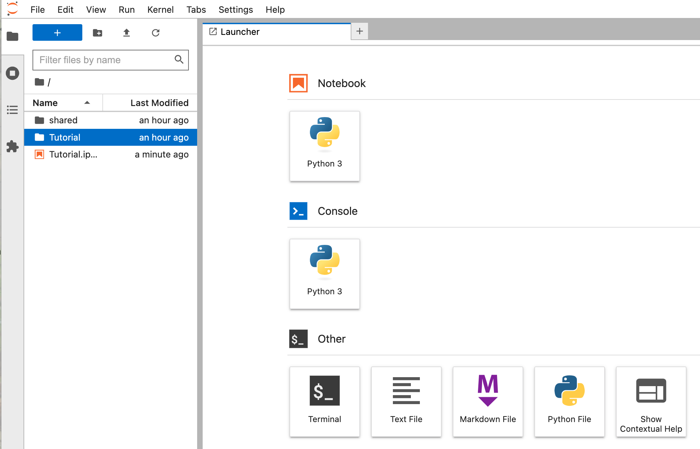
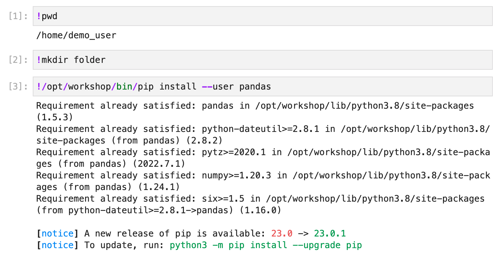
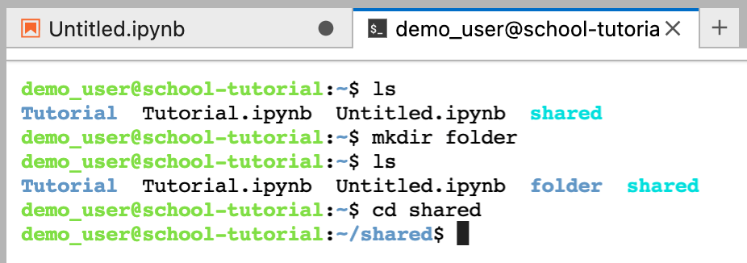

# IDIA Hackathon & School Environment Guide

## JupyterLab UI

The JupyterLab user interface (UI) has a file browser panel on the left, and a `Launcher` window, to create a new notebook, or if a notebook is open, the notebook user interface is displayed on the right.

You can open an existing notebook from the file browser panel, or create a new notebook by selecting an appropriate kernel (in the example only one kernel, `Python 3`, is available). New notebooks will be created in the current working directory as displayed in the file browser panel.



## Notebook UI

### Cell execution

Jupyter notebooks allows single cell execution, facilitating an interactive development enviroment for coding. You can run a single line of code or several lines in a singe cell, or run multiple cells at a time. You are also able to generate and display output after each cell, and assigned variables persist after cell execution.

Cells have two modes, `edit` mode for editing cell contents (indicated by a blue border), and `command` mode for cell execution. In both modes the current cell will be indicated by a blue marker on the left of the cell.


When you run a cell an indicator number will appear on the left of the cell, where the order of the numbers indicates the order in which the cells were executed.

You can edit and interact with the cells using the mouse or keyboard.

### Mouse navigation

You can click on a cell to edit it, or select the output area or area around a cell to enter command mode.

Common commands are available on the toolbar located at the top of the notebook, including copying and pasting cells, running selected cells and stopping and restarting the kernel.


Additional options to run cells are available in the `Run` menu at the top of the JupyterLab UI.


### Keyboard navigation

The notebook interface for JupyterLab includes many useful keyboard shortcuts. 

You can enter and exit edit mode using `Enter` and `Esc` respectively.
    
In edit mode, most of the keyboard is dedicated to typing into the cell's editor, therefor there are relatively few shortcuts in this mode.  In command mode, almost the entire keyboard is available for shortcuts, so there are many more.  The `Settings`-> `Advanced Settings Editor` -> `Keyboard Shortcuts` menu lists the available shortcuts.

Common keyboard shortcuts include:
    
1. Basic navigation: `enter`, `shift-enter`, `up/k`, `down/j`
4. Cell creation: `a`, `b` - to create cells above or below the current cell
2. Saving the notebook: `s`
3. Change Cell types: `y`, `m`, `1-6`, `t` - change to code, markup, etc.
5. Cell editing: `x`, `c`, `v`, `d,d` (press twice), `z` - cut, copy, paste, delete cells, and undo
6. Kernel operations: `i,i`, `0,0` - interrupt or restart kernel

### Useful tools

**Restarting the kernel**

If you want to clear all variables and start the notebook fresh you can restart the kernel, either from the toolbar or `Kernel` menu.


In the JupyterHub UI, the left panel includes a tab, indicated by the  icon, to view `Running Terminals and Kernels`, where you can view and interact with active kernels.

**Package function information**

You can use `tab`-completion to view package functions, or to autocomplete a function name.


You can user `shift-tab` to show function docstrings. This is useful if you want to view the inputs a function requires, or other function information.


You can view a function's docstring as output in the notebook by executing the cell with the relevant function followed by a `?`.


**Uploading files from local workstation**

You can upload files from your local workstation to the school environment using the upload files icon, , located above the file browser panel.

**Execute bash commands in notebook**

You can execute bash commands on the underlying operating system (outside of the Python environment) from the notebook by prefixing a command with a `!`.



## Terminal

A terminal feature is available to use within the JupyterLab UI, allowing you to run bash commands and navigate the directory structure in a typical shell environment. A new terminal can be started from the `Launcher` or from the menu `File` -> `New` -> `Terminal`. 



## Customising the kernel environment

### Installing a new library

If you want to install a new Python library, you can request for a workshop tutor or coordinator to install the new library in the default kernel (requires sudo). This will make the new library available to any members using the default kernel.

```bash
$ sudo /opt/workshop/bin/python -m pip install <package>
```

As a participant, you can install Python libraries as a local install using the following command:

```bash
$ /opt/workshop/bin/python -m pip install --user <package>
```

This will install the library at `/home/<username>/.local/lib/python3.8/site-packages`, and the new library will be available when using the default kernel, but only for your user.

### Creating your own kernel

The Python kernel(s) available in the workshop Jupyter environment point to Python virtual environments. You can create your own virtual environment and install your own packages by running the following steps. First a Python virtual environment is created, the `ipkernel` package is then installed in the new virtual environment, and `ipython` is used to create the custom kernel local to your user.

```bash
$ python -m venv ~/venv/demo
$ source ~/venv/demo/bin/activate
(demo)$ python -m pip install ipykernel
(demo)$ ipython kernel install --name "my_python_kernel" --user
```

You can then install any Python libraries in this new virtual environment and they will be usable in the new kernel in Jupyter.

```bash
(demo)$ python -m pip install numpy scipy pandas
```
Or
```bash
$ ~/venv/demo/bin/python -m pip install <package>
```

Note this new kernel will only be visible to the user who created the virtual environment and installed the kernel.

References:
1. https://github.com/jupyter/notebook/blob/main/docs/source/examples/Notebook/Notebook%20Basics.ipynb
2. https://github.com/darabigdata/IDWBotswana/blob/master/IDIA/README.md